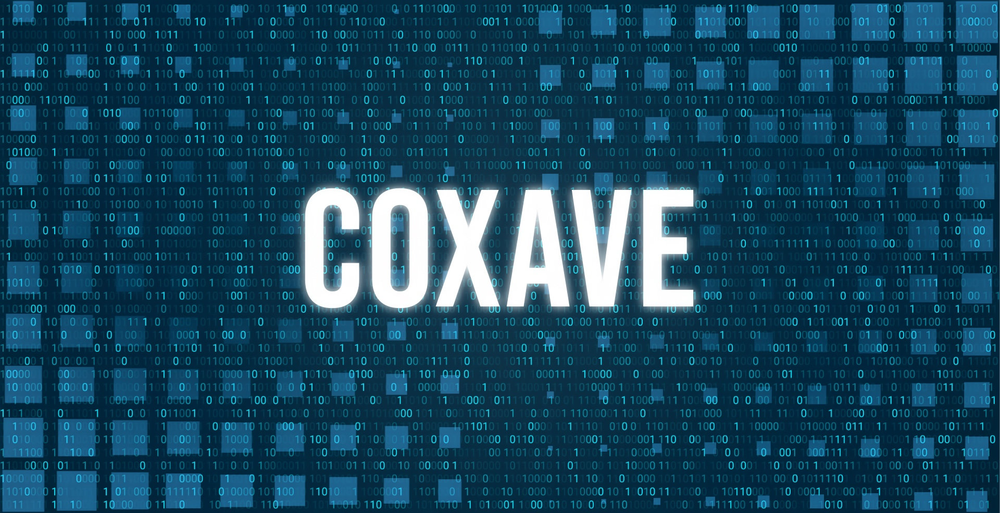

[](https://deps.rs/repo/github/xavetar/COXave)
[](https://opensource.org/licenses/Apache-2.0)
[](https://opensource.org/licenses/MIT)

# COXave



<div style="display: flex; justify-content: center; gap: 20px;">
    <a href="https://nowpayments.io/donation?api_key=NRH28QG-ABRM7CC-J7NVGXN-F8FTRS1&source=lk_donation&medium=referral" target="_blank">
        
    </a>
</div>

## About

The library is hosted on [crates.io](https://crates.io/crates/COXave/).

## Add library

CLI:

```shell
cargo add COXave
```

Cargo.toml:

```toml
[dependencies]
COXave = { version = "*" }
```

## Features

Add feature to Cargo.toml to use universal functors (without SIMD-accelerated):

```toml
[dependencies]
COXave = { version = "*", features = ["universal"] }
```

## Build

### Specify target instruction set

#### ARM/AARCH64

##### V7/NEON

```shell
export RUSTFLAGS="-C target-feature=+neon,+v7"
```

##### V8/NEON

```shell
export RUSTFLAGS="-C target-feature=+neon"
```

#### x86/x86_64

##### SSE/SSE2

```shell
export RUSTFLAGS="-C target-feature=+sse,+sse2"
```

##### SSE/SSE2 (+SSSE3)

```shell
export RUSTFLAGS="-C target-feature=+sse,+sse2,+ssse3"
```

##### AVX/AVX2

```shell
export RUSTFLAGS="-C target-feature=+avx,+avx2"
```

##### AVX-512F/AVX-512BW

```shell
export RUSTFLAGS="-C target-feature=+avx512f,+avx512bw"
```

Before using unstable features you need to run this:

```shell
rustup default nightly || rustup toolchain install nightly
```

### Usage with Python

```shell
maturin build -m api/Cargo.toml --release --features python && pip install --force-reinstall target/wheels/COXave-*.whl
```

## License

COXave is primarily distributed under the terms of three the Anti-Virus license and MIT license and the Apache License (Version 2.0)

See [LICENSE-ANTI-VIRUS](LICENSE) and [LICENSE-APACHE](LICENSE) and [LICENSE-MIT](LICENSE) for details.